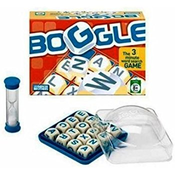
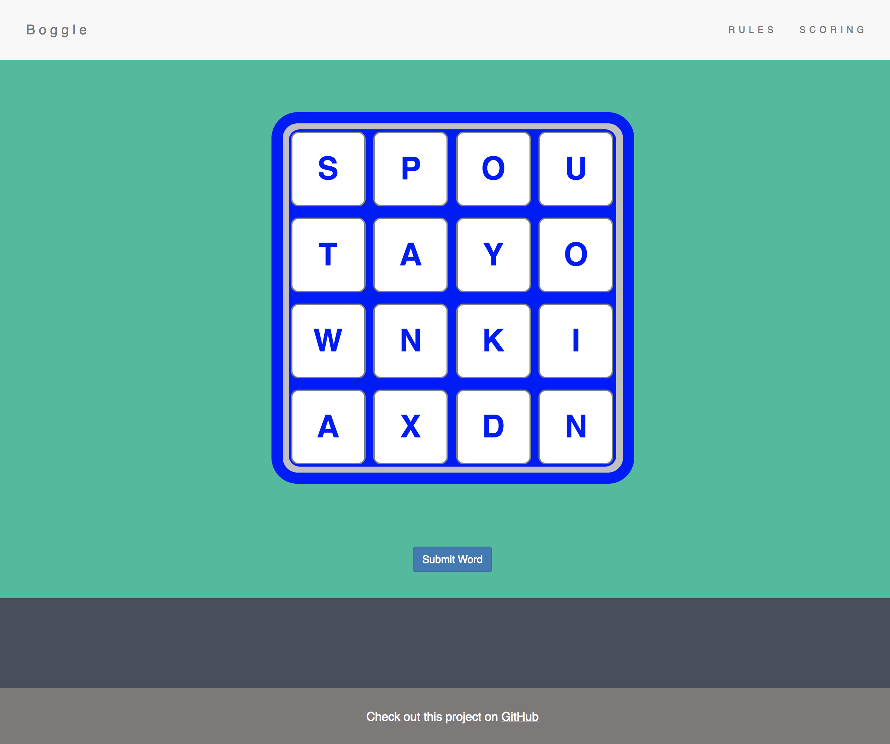
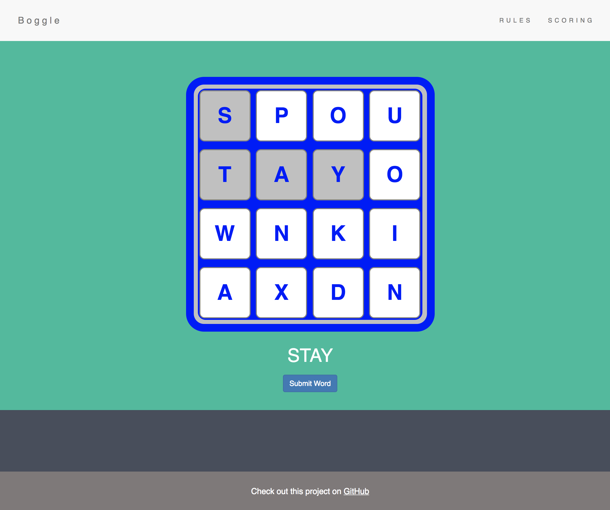
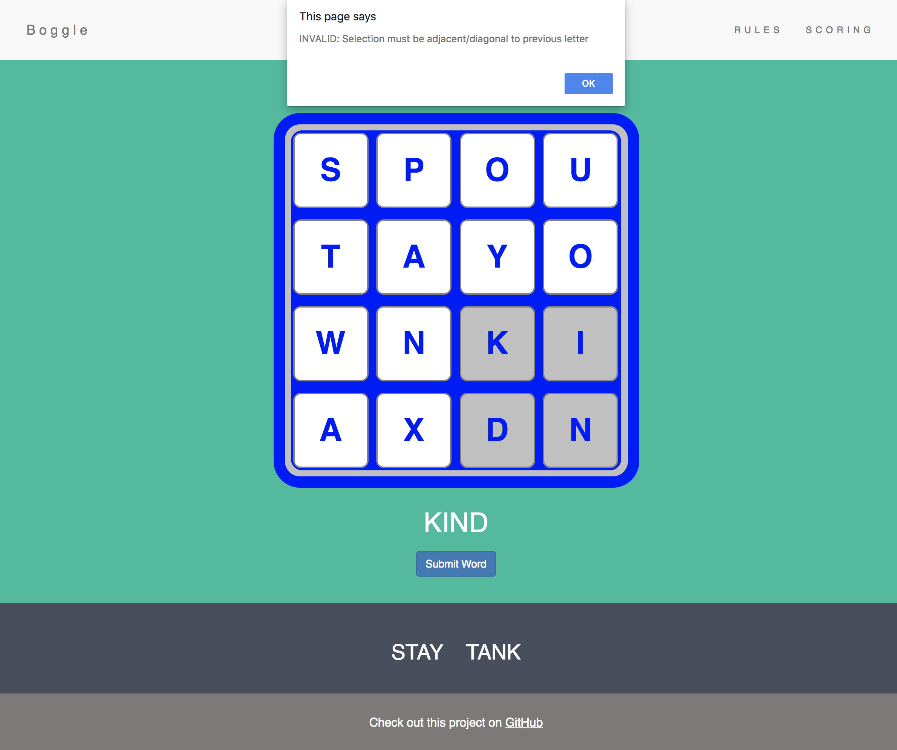
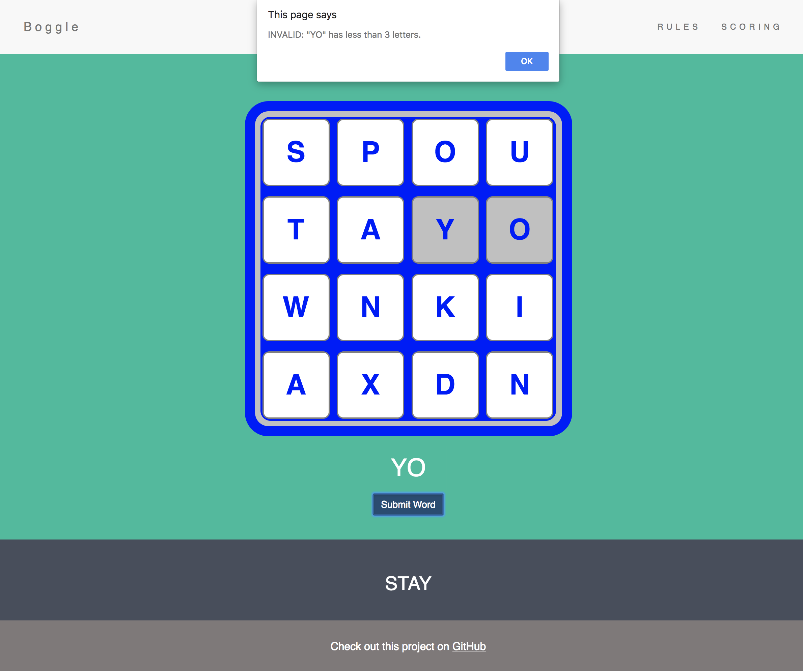

<h3 align="center">An online single-player game inspired by Boggle!</h3>

<a href="https://jballin.github.io/boggle/">Click here to play!</a>

**Objective**

Make as many words as you can!

**Rules**

Subsequent letters must be touching adjacently or diagonally and can’t be re-used. Words must be at least 3 letters long, be in the dictionary, and not be a proper noun.

**Instructions**

Click on letters to form a word and click “submit” when done.

**Scoring**

| Word length   | Points        |
| ------------- |:-------------:|
| 3, 4          | 1             |
| 5             | 2             |
| 6             | 3             |
| 7             | 5             |
| 8+            | 11            |

*Note: ‘Qu’ counts as 2 letters.*

---

Built by @JBallin and @CorriMori for their Q1 Project at Galvanize’s Web Development Bootcamp.

This project uses HTML, CSS, Bootstrap, JavaScript, Git, and GitHub.

---

<h3 align="center">Screenshots</h3>

  
    
  
    
  
    
  

